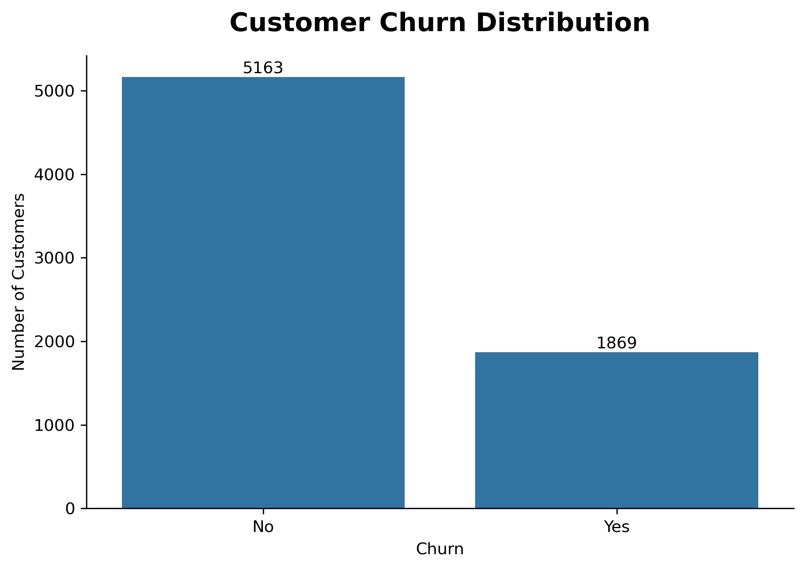
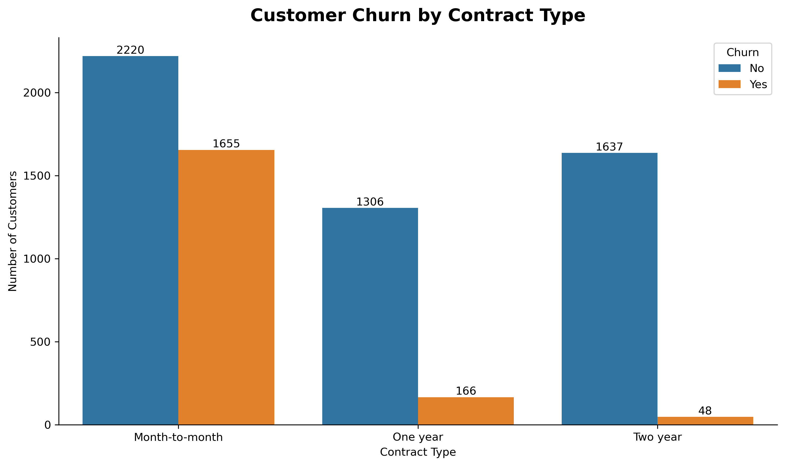
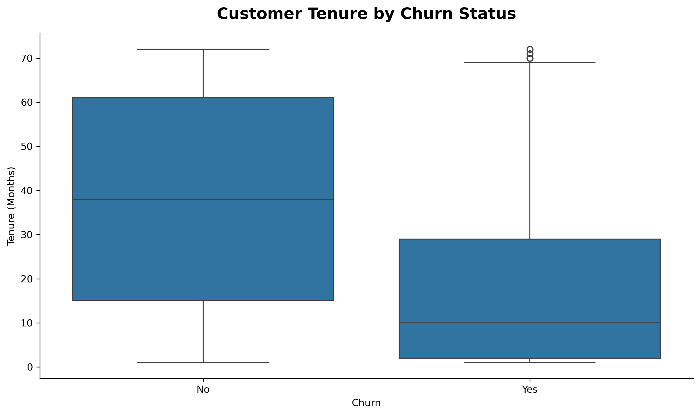
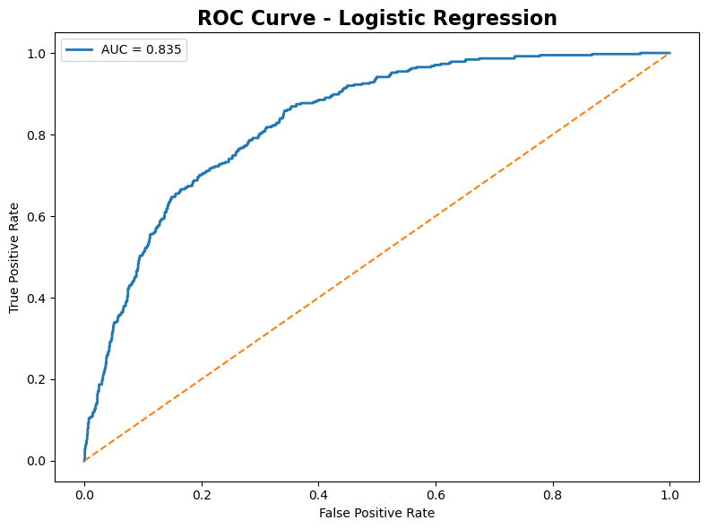
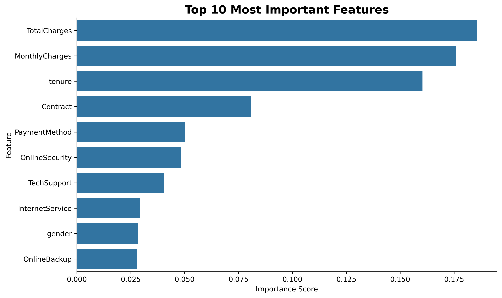

# Customer Churn Prediction

## Overview

This project uses machine learning techniques to predict customer churn and identify the factors that contribute to customer attrition.

The analysis combines exploratory data analysis, feature engineering, classification modelling, and business recommendations.

---

## Business Problem

Customer churn has a direct impact on revenue and customer acquisition costs.

The objective of this project is to:

- Predict customer churn
- Identify key churn drivers
- Provide actionable business recommendations

---

## Dataset

IBM Telco Customer Churn Dataset

Features include:

- Customer demographics
- Contract type
- Monthly charges
- Tenure
- Internet services
- Payment methods

Target variable:

- Churn (Yes / No)

---

## Technologies Used

- Python
- Pandas
- NumPy
- Matplotlib
- Seaborn
- Scikit-Learn
- Jupyter Notebook

---

## Exploratory Analysis

### Customer Churn Distribution

### Contract Type vs Churn

### Customer Tenure vs Churn

---

## Machine Learning Models

### Logistic Regression

Accuracy: 79.6%

### Random Forest

Accuracy: 79.0%

---

## ROC Curve

---

## Feature Importance

---

## Key Findings

- Month-to-month customers are significantly more likely to churn.
- Short-tenure customers represent the highest risk segment.
- Customers with higher monthly charges exhibit higher churn rates.
- Contract type, tenure, and charges are the strongest churn predictors.

---

## Business Recommendations

1. Improve onboarding for new customers.
2. Promote annual and multi-year contracts.
3. Offer bundled service packages.
4. Review pricing strategies for high-risk customers.

---

## Author

Ruchitha Sampath

MSc Data Science | Software Engineer | Machine Learning Enthusiast